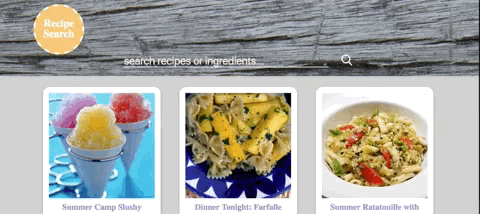

# Recipe Search

## Description

Recipe Search is an application allows users to easily search for meal ideas across a large collection of websites, with over 1.5 million total recipes.

### Users can search for specific recipes:

 
### Users can also search for recipes with a key ingredient:

## Technologies
- ReactJS
- ES6 (ES2015)
- Axios
- Edamam API
- Babel / Webpack
- Sass
- flexbox

## Launching the application
- git clone https://github.com/tjking20/Recipe_Search.git

- yarn install 

- yarn start

or visit  https://react-recipe-search.herokuapp.com/

